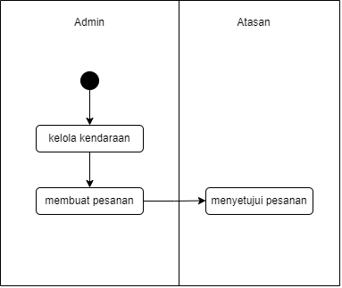

## Aplikasi Kelola Kendaraan

## Rancangan database



## set up 
- database version
```bash
phpmyadmin: "5.2.0"
```
- PHP version
```bash
PHP: "8.1"
```
- laravel version
```bash
laravel: "10"
```

- set up .env
```bash
FILESYSTEM_DISK=public
```
- ketikan perintah di terminal
```bash
php artisan storage:link
```
- buat database di hpmyadmin dan set up di .env
```bash
DB_DATABASE=pemesanan_kendaraan
```
- migrate
```bash
php artisan migrate --seed
```

# jalankan 
- ketikan perintah ini di terminal
```bash
composer update / composer install
```

# login halaman admin :
- email
```bash
admin@gmail.com
```
- password
```bash
password
```

# login halaman atasan :
- email
```bash
fajar@gmail.com
fabian@gmail.com
```
- password
```bash
password
password
```

# jalankan server di terminal
- migrate database
```bash
php artisan serve
```
